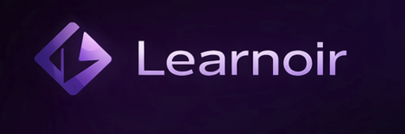

<p align="center">
  
</p>

<h1 align="center">Learnoir AI</h1>

<p align="center">
  An AI-powered career development platform that analyzes your resume, maps your skill gaps, and builds a personalized path to your dream role.
</p>

<p align="center">
  
  
  
  
  
  
</p>

---

## What It Does

Learnoir AI takes your resume and turns it into a full career action plan. Upload your PDF, pick a target role, and the platform does the rest — it tells you what you're missing, what to learn, how to prepare for interviews, and exactly how a recruiter would judge your profile today.

---

## Features

### 🔍 Resume Analysis
Upload a PDF resume and get a full breakdown — ATS compatibility score, extracted skills, role match percentage, recruiter simulation (how you'd get selected or rejected), and specific improvement tips. Uses a hybrid parsing pipeline combining `pdfplumber` for fast baseline extraction and multimodal Gemini API calls for deep qualitative analysis.

### 🎯 Role Matching
Cross-references your extracted skills against categorized industry roles (Frontend, Backend, DevOps, Data Science) and computes match percentages with a precise list of missing skills per role.

### 🗺️ Personalized Learning Roadmaps
Generates week-by-week learning curricula tailored to your skill gaps — including tasks, projects, and resources for each week. Not generic content; built specifically from what your resume is missing.

### 🎤 Interview Preparation
Role-specific mock interview questions across configurable difficulty levels and topics. Mix of MCQ and open-ended questions with AI-generated explanations and performance tracking.

### 💻 Coding Practice
LeetCode-style algorithmic problems generated by AI, with code submission evaluation and test-case feedback — all inside the platform.

### 🏆 Gamification Engine
Learning streaks, milestone achievements, and progression tracking to keep you accountable across your roadmap.

### 💳 Subscription & Payments
Tier-based premium access integrated with Razorpay, gating advanced AI features behind a subscription model.

---

## Tech Stack

| Layer | Technology |
|---|---|
| Frontend | Next.js 15, React 19, TypeScript, Tailwind CSS v4 |
| Auth | NextAuth.js, Google OAuth, JWT |
| Backend | FastAPI, Uvicorn (ASGI) |
| AI | Gemini 2.5 Flash (`google-generativeai`) |
| Resume Parsing | pdfplumber, Python regex |
| Database | SQLite, SQLAlchemy ORM, Alembic |
| Security | python-jose (JWT), passlib (bcrypt) |
| Payments | Razorpay SDK |
| Visualization | Recharts |

---

## Architecture

```
┌─────────────────────────────────────────────┐
│              Next.js Frontend               │
│     (TypeScript, Tailwind, NextAuth.js)     │
└────────────────────┬────────────────────────┘
                     │ REST API (JWT)
┌────────────────────▼────────────────────────┐
│              FastAPI Backend                │
│  /api/auth  /api/resume  /api/roadmap       │
│  /api/coding  /api/gamification  /api/pay   │
└──────┬──────────────────────────┬───────────┘
       │                          │
┌──────▼──────┐          ┌────────▼────────┐
│  SQLite DB  │          │  Gemini API     │
│ SQLAlchemy  │          │  GeminiService  │
│  Alembic    │          │  (with fallback)│
└─────────────┘          └─────────────────┘
```

### Modular API Routers
```
/api/auth          → Register, login, OTP, OAuth sync
/api/resume        → Upload, analyze, save, retrieve
/api/roadmap       → Generate, fetch, track progress
/api/coding        → Problems, submissions, evaluation
/api/gamification  → Streaks, achievements, badges
/api/payments      → Razorpay orders, verification
```

---

## Database Schema

```
users               → identity, role target, streak, OTP, subscription
resume_data         → parsed skills, experience JSON, raw PDF blob
roadmaps            → outer timeframe, target role
roadmap_items       → weekly tasks, projects, resources (JSON)
coding_problems     → AI-generated challenges, constraints, I/O
coding_submissions  → user code, execution state, pass/fail
achievements        → milestone ledger per user
interview_attempts  → quiz performance, scores, history
payments            → Razorpay order IDs, status, amounts
```

---

## Engineering Decisions Worth Knowing

**Hybrid Resume Parsing Pipeline**
Rather than sending every resume directly to Gemini (slow + costly), the system first runs `pdfplumber` with regex-based skill matching for a sub-second baseline extraction. Only then does it invoke the multimodal Gemini call for deep qualitative feedback. Best of both — speed and intelligence.

**AI Rate Limit Resilience**
`GeminiService` is built as a self-healing facade. On HTTP 429 (quota exceeded) or any API outage, it switches the current server thread into Mock Data Mode — the frontend never crashes or hangs, it just receives structured mock responses instead. This was a deliberate reliability engineering decision, not an afterthought.

**Idempotent OAuth Sync**
When a user signs in with Google via NextAuth, the backend `/api/auth/oauth-sync` endpoint checks if the email already exists. If it does, it reconciles the profile in place. If not, it provisions a new account with a `token_urlsafe(32)` cryptographically random password — preventing backdoor credential logins for OAuth-origin accounts.

---

## Running Locally

### Prerequisites
- Python 3.11+
- Node.js 18+
- A Gemini API key (free tier works)
- A Razorpay account (test mode works)

### Backend
```bash
cd backend
python -m venv venv
source venv/bin/activate        # Windows: venv\Scripts\activate
pip install -r requirements.txt

# Create a .env file
cp .env.example .env
# Fill in: GEMINI_API_KEY, JWT_SECRET, RAZORPAY_KEY_ID, RAZORPAY_KEY_SECRET

# Run migrations
alembic upgrade head

# Start server
uvicorn app.main:app --reload --port 8000
```

### Frontend
```bash
cd frontend
npm install

# Create .env.local
cp .env.example .env.local
# Fill in: NEXTAUTH_SECRET, NEXTAUTH_URL, NEXT_PUBLIC_API_URL, GOOGLE_CLIENT_ID, GOOGLE_CLIENT_SECRET

npm run dev
```

Backend runs on `http://localhost:8000`
Frontend runs on `http://localhost:3000`
API docs available at `http://localhost:8000/docs`

---

## What I Learned

This project pushed me beyond standard CRUD into real AI engineering problems — specifically around reliability. The rate limit fallback system taught me to think about what happens when external dependencies fail, not just when they work. The hybrid parsing pipeline was a conscious cost-performance tradeoff decision. And the OAuth sync logic forced me to think about idempotency in a way that purely REST-based projects don't.

---

## Author

**Rashmi Ranjan Badajena**
[GitHub](https://github.com/rashCoded) · [LinkedIn](https://www.linkedin.com/in/rashmiranjan-badajena/) · rashmiranjanbadajena.it@gmail.com

---

<p align="center">Built with curiosity and way too many Gemini API calls.</p>
